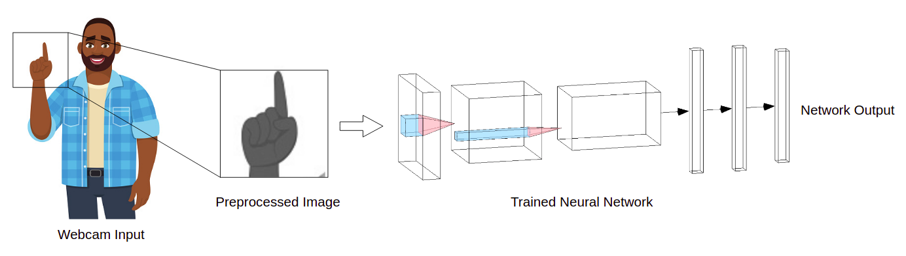

# SignLing
## Application for learning russian sign language
.png)

## Что оно делает? 
Приложение SignLingo направлено на упрощение коммуникации между слышащими людьми и людьми с нарушениями слуха и речи, а также на обучение русскому жестовому языку (РЖЯ) с использованием современных технологий.

Приложение SignLingo позволяет пользователям вводить текст, который преобразуется в изображения соответствующих жестов РЖЯ. С помощью веб-камеры и специально обученной нейронной сети  программа распознаёт жесты пользователя и выводит их текстовый эквивалент. Это обеспечивает интерактивное обучение и проверку правильности выполнения жестов в реальном времени.

Проект также способствует социальной интеграции людей с нарушениями слуха, предоставляя инструмент для эффективного общения и изучения РЖЯ. SignLingo поддерживает работу в офлайн-режиме, что делает его удобным для использования в любых условиях

## Цели проекта "SignLingo":

1. **Решение проблемы коммуникации**: Обеспечить эффективное взаимодействие между слышащими людьми и людьми с нарушениями слуха и речи через разработку приложения для перевода русского жестового языка (РЖЯ)
2. **Технологическая независимость**: Создание отечественного решения для распознавания жестового языка, способствующего импортозамещению
3. **Разработка интуитивного интерфейса**: Создание удобного и понятного интерфейса для мобильного и десктопного приложения
4. **Обучение нейросети**: Разработка и обучение нейронной сети для точного распознавания жестов русского жестового языка
5. **Социализация глухонемых людей**: Способствовать интеграции людей с нарушениями слуха в общество через цифровые технологии
6. **Обучение РЖЯ**: Предоставить возможность пользователям изучать базовый уровень русского жестового языка

## Как это работает? 

1. Создание алгоритма для перевода букв в жесты РЖЯ
2. Создание графического интерфейса для приложения
3. Создание датасета для обучения нейронной сети
4. Захват видео-изображения рук с вебкамеры
4. Обучение нейронной сети на созданном датасете

## Результаты проекта:

1. **Создание приложения SignLingo**:
   - Разработана десктопная версия приложения, с планами по созданию мобильной версии
   - Реализован интуитивно понятный интерфейс, позволяющий вводить текст и получать соответствующие жесты в виде изображений
   - Нейросеть распознает жесты пользователя и выводит их в текстовом формате

2. **Функциональность**:
   - Поддержка перевода в режиме реального времени
   - Возможность работы в офлайн-режиме
   - Распознавание жестов русского жестового языка
   - Целевая аудитория включает людей с ограничениями слуха и речи, а также тех, кто хочет изучать РЖЯ

3. **Конкурентные преимущества**:
   - В отличие от аналогов (Google Live Transcribe, Адаптик, Сурдорон, Яндекс Разговор), SignLingo сочетает перевод в реальном времени, офлайн-режим, распознавание жестов и ориентирован на людей с нарушениями слуха/речи
   - Фокус на русском жестовом языке, что делает проект уникальным для российского рынка

4. **Социальный эффект**:
   - Улучшение коммуникации между слышащими и глухонемыми людьми
   - Повышение доступности изучения РЖЯ для широкой аудитории
   - Поддержка социализации людей с нарушениями слуха

5. **Планы по развитию**:
   - Введение новых функций
   - Создание мобильной версии приложения
   - Добавление продвинутого уровня изучения РЖЯ
